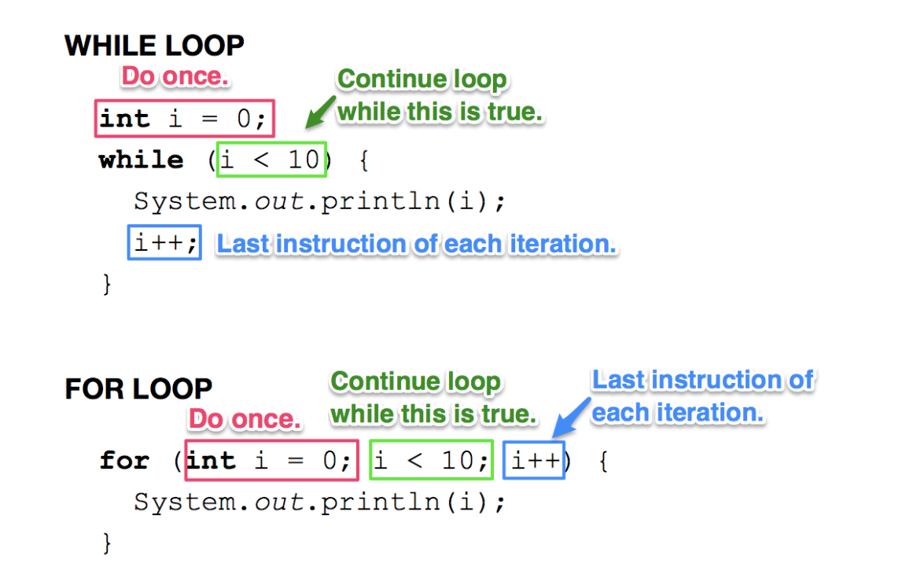

# CS2 — Unit Notes: Loops Review

These notes cover `while` and `for` loops from CS1. Both will appear constantly in CS2 — especially when working with arrays. Use these notes to review, catch up, or study for quizzes.

Both loop types have the same three parts — just written in different places:



---

## 1. The While Loop

A `while` loop repeats a block of code **as long as a condition is true**.

```java
while (condition) {
    // body — runs repeatedly until condition is false
}
```

**How it works:**
1. Check the condition
2. If true → run the body, then go back to step 1
3. If false → exit the loop

**Example:**
```java
int n = 1;
while (n <= 5) {
    System.out.println(n);
    n++;
}
```

Trace:

| n at start | condition (n <= 5) | prints | n after n++ |
|---|---|---|---|
| 1 | true | 1 | 2 |
| 2 | true | 2 | 3 |
| 3 | true | 3 | 4 |
| 4 | true | 4 | 5 |
| 5 | true | 5 | 6 |
| 6 | false | — | loop exits |

Output:
```
1
2
3
4
5
```

**The three things every while loop needs:**
1. **Initialize** the variable before the loop
2. **Check** the condition at the top
3. **Update** the variable inside the body (or the loop runs forever)

---

## 2. The For Loop

A `for` loop packages initialize, check, and update into one line. Use it when you know exactly how many times you want to loop.

```java
for (initialize; condition; update) {
    // body
}
```

| Part | Purpose | Example |
|---|---|---|
| `initialize` | Sets up the loop variable — runs once at the start | `int i = 0` |
| `condition` | Checked before each iteration — loop runs while true | `i < 5` |
| `update` | Runs after each iteration | `i++` |

**Example:**
```java
for (int i = 0; i < 5; i++) {
    System.out.println(i * i);
}
```

Trace:

| i | condition (i < 5) | prints | after i++ |
|---|---|---|---|
| 0 | true | 0 | 1 |
| 1 | true | 1 | 2 |
| 2 | true | 4 | 3 |
| 3 | true | 9 | 4 |
| 4 | true | 16 | 5 |
| 5 | false | — | loop exits |

Output:
```
0
1
4
9
16
```

---

## 3. While vs. For — When to Use Which

| Use `for` when… | Use `while` when… |
|---|---|
| You know the number of iterations in advance | The number of iterations depends on what happens at runtime |
| Counting up or down through a range | Waiting for a condition to become true |
| Iterating over an array (coming soon) | Reading input until the user types "quit" |

**Same result, two styles:**
```java
// for loop
for (int i = 1; i <= 5; i++) {
    System.out.println(i);
}

// equivalent while loop
int i = 1;
while (i <= 5) {
    System.out.println(i);
    i++;
}
```

Both print 1 through 5. The `for` loop is more compact and keeps all three loop parts in one place.

---

## 4. Common Loop Patterns

### Counter
Count how many values meet a condition:
```java
int count = 0;
for (int i = 1; i <= 100; i++) {
    if (i % 3 == 0) {
        count++;
    }
}
System.out.println(count);   // 33
```

### Accumulator
Build up a total:
```java
int sum = 0;
for (int i = 1; i <= 10; i++) {
    sum += i;
}
System.out.println(sum);   // 55
```

### Stepping by values other than 1
```java
// Multiples of 5 from 5 to 50
for (int i = 5; i <= 50; i += 5) {
    System.out.println(i);
}

// Count down
for (int i = 10; i >= 0; i--) {
    System.out.println(i);
}
```

---

## 5. Common Errors

### Infinite loop — forgetting to update
```java
int i = 0;
while (i < 10) {
    System.out.println(i);
    // i never changes — loops forever!
}
```
Fix: add `i++;` inside the body.

### Off-by-one — wrong boundary
```java
// Intended: sum 1 through 10
int sum = 0;
for (int i = 1; i < 10; i++) {   // stops at 9, never adds 10
    sum += i;
}
```
Fix: change `i < 10` to `i <= 10`. Rule of thumb: use `<=` when you want to include the last value.

### Double increment — updating i twice
```java
for (int i = 0; i <= 5; i++) {
    System.out.println(i);
    i++;    // i increments here AND in the for header
}
```
`i` steps through 0, 2, 4 — prints only even values. Fix: remove the `i++` from the body.

### Using loop variable after it expires
```java
for (int i = 0; i < 5; i++) {
    // ...
}
System.out.println(i);   // ERROR — i only exists inside the loop
```
Fix: declare `i` before the loop if you need it afterward.

---

## Check Your Understanding

**Unit 1 · Chapter 2**

### Part A: Concepts

**1.** What are the three things every loop needs to avoid running forever?

**2.** What is the difference between `i < 10` and `i <= 10` as a loop condition? When does it matter?

**3.** When is a `for` loop more appropriate than a `while` loop? Give an example of a situation where you would choose `while`.

**4.** What is an accumulator pattern? Write one sentence describing it and give the variable name you would typically use.

**5.** What happens if you forget to increment `i` inside a `while` loop?

---

### Part B: Predict the Output

**6.**
```java
int n = 5;
while (n > 0) {
    System.out.print(n + " ");
    n--;
}
```

**7.**
```java
int total = 0;
for (int i = 1; i <= 4; i++) {
    total += i * 2;
}
System.out.println(total);
```

**8.**
```java
int i = 1;
while (i < 10) {
    i *= 3;
}
System.out.println(i);
```

**9.**
```java
for (int i = 10; i >= 1; i -= 3) {
    System.out.print(i + " ");
}
```

---

### Part C: Write the Loop

**10.** Write a `for` loop that prints every even number from 2 to 20.

**11.** Write a `while` loop that starts at 1 and keeps doubling until the value exceeds 100. Print the final value.

**12.** Write a loop that counts how many numbers from 1 to 50 are divisible by 3 or by 5, and prints the count.

---

### Part D: Find the Bug

**13.**
```java
for (int i = 1; i <= 5; i++) {
    System.out.println(i);
    i++;
}
```
What does this actually print? What did the student probably intend?

**14.**
```java
int x = 10;
while (x != 0) {
    x -= 3;
}
System.out.println(x);
```
Will this loop ever end? Explain.

---
---

## Answer Key

### Part A: Concepts

**1.** Initialize the variable before the loop; check the condition; update the variable inside the loop body (or in the for header).

**2.** `i < 10` stops before 10 (last value is 9). `i <= 10` includes 10 (last value is 10). It matters any time the last value in a range is meaningful — e.g. summing 1 through 10 requires `i <= 10`.

**3.** Use `for` when you know the number of iterations in advance (e.g. looping 10 times, iterating through an array). Use `while` when the number of iterations depends on a runtime condition (e.g. keep asking for input until the user enters a valid number).

**4.** An accumulator pattern builds up a running total by adding to a variable each iteration. The variable is usually called `sum`, `total`, or `count`.

**5.** The condition never becomes false, so the loop runs forever — an infinite loop. The program appears to freeze.

### Part B: Predict the Output

**6.**
```
5 4 3 2 1 
```

**7.**
```
20
```
`total` accumulates 2 + 4 + 6 + 8 = 20.

**8.**
```
27
```
Trace: i starts at 1. 1×3=3, 3×3=9, 9×3=27. Now 27 < 10 is false, loop exits. Prints 27.

**9.**
```
10 7 4 1 
```
i steps: 10, 7, 4, 1, then 1-3 = -2 which is not >= 1, so loop exits.

### Part C: Write the Loop

**10.**
```java
for (int i = 2; i <= 20; i += 2) {
    System.out.println(i);
}
```

**11.**
```java
int n = 1;
while (n <= 100) {
    n *= 2;
}
System.out.println(n);   // prints 128
```

**12.**
```java
int count = 0;
for (int i = 1; i <= 50; i++) {
    if (i % 3 == 0 || i % 5 == 0) {
        count++;
    }
}
System.out.println(count);   // 26
```

### Part D: Find the Bug

**13.** `i` is incremented twice each pass — once by `i++` in the body and once by the for header. It prints `1 3 5` instead of `1 2 3 4 5`. The student intended to print every value from 1 to 5. Fix: remove `i++` from the body.

**14.** No — this loop never ends. Starting at 10 and subtracting 3 each time: 10, 7, 4, 1, -2, -5... `x` skips over 0 entirely and keeps decreasing. The condition `x != 0` is never false. Fix: change the condition to `x > 0`.

---

## Homework 2: Loops Review

!!! attention

    **Unit 1 · Chapter 2**

    *Assigned Class 2 · Due Class 3*

    ### Part 1: Predict the Output — While Loops

    1.
    ```java
    int n = 1;
    while (n <= 5) {
        System.out.println(n);
        n++;
    }
    ```

    2. Trace each iteration, then write the final output.
    ```java
    int x = 100;
    while (x > 10) {
        x /= 2;
    }
    System.out.println(x);
    ```

    3.
    ```java
    int count = 0;
    int i = 1;
    while (i <= 20) {
        if (i % 3 == 0) {
            count++;
        }
        i++;
    }
    System.out.println(count);
    ```

    ### Part 2: Predict the Output — For Loops

    4.
    ```java
    for (int i = 0; i < 5; i++) {
        System.out.print(i * i + " ");
    }
    ```

    5.
    ```java
    int sum = 0;
    for (int i = 1; i <= 10; i++) {
        sum += i;
    }
    System.out.println(sum);
    ```

    6.
    ```java
    for (int i = 1; i <= 5; i++) {
        if (i % 2 == 0) {
            System.out.println(i + " is even");
        } else {
            System.out.println(i + " is odd");
        }
    }
    ```

    7. What math operation does this loop compute?
    ```java
    int result = 1;
    for (int i = 1; i <= 5; i++) {
        result *= i;
    }
    System.out.println(result);
    ```

    ### Part 3: Write the Loop

    8. Write a `while` loop that prints every multiple of 7 from 7 to 70 (inclusive).

    9. Write a `for` loop that computes and prints the sum of all odd numbers from 1 to 99.

    10. Write a `for` loop that counts how many integers from 1 to 100 are divisible by 4 but not by 8, and prints the count.

    11. Write a loop (your choice of `while` or `for`) that prints the following pattern:
    ```
    5
    10
    15
    20
    25
    ```

    ### Part 4: Find the Bug

    12.
    ```java
    int i = 0;
    while (i < 10) {
        System.out.println(i);
    }
    ```

    13. This runs without error — but a student expected it to print the sum 1 through 10. What is wrong?
    ```java
    int total = 0;
    for (int i = 1; i < 10; i++) {
        total += i;
    }
    System.out.println(total);
    ```

    14. This runs without error — but the output isn't what the student intended. What happens and why?
    ```java
    for (int i = 0; i <= 5; i++) {
        System.out.println(i);
        i++;
    }
    ```
