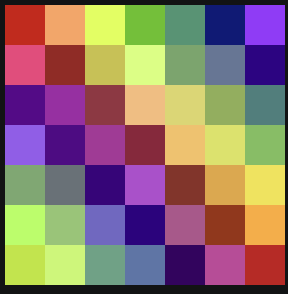

# CS2 — Unit Notes: Color and Images

---

## 1. How Colors Work: The RGB Model

Every color on a computer screen is made from three channels: **Red**, **Green**, and **Blue**. Each channel has a value from **0 to 255**, where 0 means none of that color and 255 means full intensity.

| Color | R | G | B |
|---|---|---|---|
| Black | 0 | 0 | 0 |
| White | 255 | 255 | 255 |
| Red | 255 | 0 | 0 |
| Green | 0 | 255 | 0 |
| Blue | 0 | 0 | 255 |
| Yellow | 255 | 255 | 0 |
| Gray | 128 | 128 | 128 |

A grayscale color always has equal R, G, and B values.

---

## 2. The `Color` Class

Java's `Color` class (from `java.awt.Color`) represents a single color. You create one by passing R, G, B values to the constructor:

```java
Color red    = new Color(255, 0, 0);
Color white  = new Color(255, 255, 255);
Color custom = new Color(100, 150, 200);
```

To read the channels back out:

```java
Color c = new Color(100, 150, 200);
int r = c.getRed();    // 100
int g = c.getGreen();  // 150
int b = c.getBlue();   // 200
```

`Color` is just a class — it has private fields (the channel values) and public getters. When you write your own `Pixel` class in Project 2, you'll build the same structure from scratch.

---

## 3. What Is a `BufferedImage`?

A `BufferedImage` is Java's class for representing a digital image. Internally, an image is a **2D grid of pixels** — width × height. Each pixel is a color.

```
Image (5 × 3 pixels):

   x=0   x=1   x=2   x=3   x=4
y=0 [pix] [pix] [pix] [pix] [pix]
y=1 [pix] [pix] [pix] [pix] [pix]
y=2 [pix] [pix] [pix] [pix] [pix]
```

The top-left corner is (x=0, y=0). The bottom-right corner is (x=width-1, y=height-1).

---

## 4. Reading Pixel Data

To get the color at a specific (x, y) position:

```java
Color pixel = new Color(image.getRGB(x, y));
int r = pixel.getRed();
int g = pixel.getGreen();
int b = pixel.getBlue();
```

`image.getRGB(x, y)` returns an `int` that encodes the color in a compact format. Wrapping it in `new Color(...)` unpacks it into R, G, B components you can read.

To get the image dimensions:
```java
int width  = image.getWidth();
int height = image.getHeight();
```

---

## 5. A Complete Example: Reading One Pixel

```java
// Load an image (provided by the course scaffold)
BufferedImage image = ImageIO.read(new File("photo.png"));

// Read the pixel at (10, 20)
Color pixel = new Color(image.getRGB(10, 20));
System.out.println("R: " + pixel.getRed());
System.out.println("G: " + pixel.getGreen());
System.out.println("B: " + pixel.getBlue());
```

---

## 6. Common Errors

| Error | Problem | Fix |
|---|---|---|
| `new Color(300, 0, 0)` | Values must be 0–255; 300 throws an exception | Clamp values: `Math.min(255, Math.max(0, value))` |
| Swapping x and y: `image.getRGB(y, x)` | Reads the wrong pixel | x is the column (horizontal), y is the row (vertical) |
| Forgetting `new Color(...)` wrapper | `image.getRGB()` returns an int, not a Color | Always wrap: `new Color(image.getRGB(x, y))` |

---

## Check Your Understanding

**Unit 5 · Chapter 1**

**1.** What RGB values produce pure blue?

**2.** What does a pixel with equal R, G, and B values look like?

**3.** Write code to create a `Color` with R=50, G=100, B=200, then print each channel.

**4.** An image is 800 pixels wide and 600 pixels tall. What are the x and y coordinates of the bottom-right corner pixel?

---
---

## Answer Key

**1.** R=0, G=0, B=255.

**2.** A shade of gray. The specific shade depends on the value (0=black, 128=mid-gray, 255=white).

**3.**
```java
Color c = new Color(50, 100, 200);
System.out.println(c.getRed());    // 50
System.out.println(c.getGreen());  // 100
System.out.println(c.getBlue());   // 200
```

**4.** x=799, y=599 (0-indexed: width-1, height-1).

---

## Homework 15: Color and Images

!!! attention

    **Unit 5 · Chapter 1**

    The image below, `squares.jpg`, is a 7×7 grid of colored squares. Coordinates start at `(0, 0)` in the top-left corner. The x-coordinate increases to the right; the y-coordinate increases downward. Columns and rows are both numbered 0–6.

    

    ### Part A: Understanding Coordinates in the Image

    Using the coordinate system above, answer:

    1. What color is at x = 0, y = 0?
    2. What color is at x = 3, y = 0?
    3. What color is at x = 4, y = 6?
    4. Using (x, y) notation, what color is at (2, 1)?
    5. What color is at (0, 5)?
    6. What color is at (3, 5)?

    ### Part B: Image Files in Java

    In Java, we can load an image file, such as a `.jpg`, into a `BufferedImage`. This puts the contents of the file into your code so you can access each square — each square is a pixel.

    ```java
    BufferedImage img = ImageIO.read(new File("squares.jpg"));
    ```

    We can use `img.getRGB(x, y)` to get the color of the pixel at a specific `(x, y)` location, just like Part A.

    7. What color is at `img.getRGB(0, 0)`?
    8. What color is at `img.getRGB(3, 0)`?
    9. What color is at `img.getRGB(4, 6)`?
    10. Fill in the blanks to get the red square in the lower right corner: `img.getRGB(___, ___)`
    11. Write the full expression to get the brown-ish square in the center.

    ### Part C: Understanding Color Numbers

    `img.getRGB(x, y)` returns a single integer that represents the color of a pixel — hard to read on its own (e.g. red might be `-3012602`). To make colors easier to work with, wrap it in a `Color` object:

    ```java
    Color c = new Color(img.getRGB(x, y));
    ```

    Then read the channels individually with `c.getRed()`, `c.getGreen()`, `c.getBlue()` — each on a 0–255 scale.

    12. Fill in the blanks to get the `Color` object for the pixel at (3, 6): `Color c = new Color(img.______(__, __));`
    13. Using that `Color` variable, fill in the blank to get the red value: `int red = c.get__();`
    14. Considering the red value is on a scale of 0–255, guess what that expression would return for this pixel.
    15. Look at the pixel at (5, 0). a) Do you expect the green value to be high, medium, or low? b) What about the blue value?
    16. Complete the code below to get the green value for the pixel at (0, 0):
    ```java
    Color c = new Color(______________); // get color at (0, 0)
    int green = _____________;           // get green value 0-255
    ```
    17. If the red, green, and blue values are all 0 for a pixel, what color would you expect the square to look like?
    18. If the red, green, and blue values are all 255 for a pixel, what color would you expect, and why?
    19. For a pure red square, what values would you expect for `getRed()`, `getGreen()`, `getBlue()`?
    20. For a pure green square, what values would you expect for the same three?
    21. The center brown(ish) square is at (3, 3). Predict whether its red, green, and blue values will all be the same, or if some will be higher than others. Explain your reasoning.

    **Quick reference — common pure colors (0–255 scale):** Pure Red `(255, 0, 0)` · Pure Green `(0, 255, 0)` · Pure Blue `(0, 0, 255)` · Pure Yellow `(255, 255, 0)` · Black `(0, 0, 0)` · White `(255, 255, 255)`
